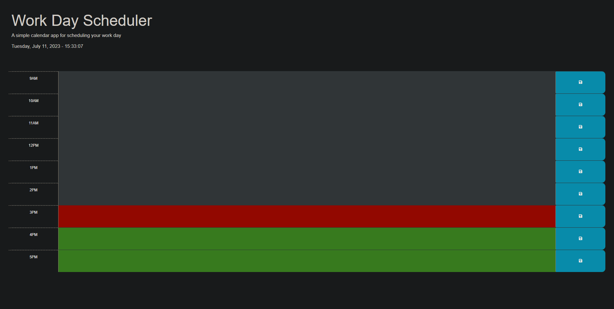

# Work Day Scheduler
A simple web application for scheduling your work day. The Work Day Scheduler allows you to add important events to a daily planner, helping you manage your time effectively.

## Work Day Scheduler
https://ccovin1.github.io/time-planer-project/

## Features
Displays the current date and time at the top of the calendar.
Provides time blocks for standard business hours from 9 AM to 5 PM.
Time blocks are color-coded to indicate whether they are in the past, present, or future.
Allows you to enter events for each time block.
Automatically saves the entered events in the browser's local storage.
Persistently displays the saved events even after refreshing the page.

## Technologies Used
HTML
CSS (Bootstrap framework)
JavaScript (jQuery library and Day.js library)

## Getting Started
To use the Work Day Scheduler, follow these steps:

Clone this repository to your local machine or download the ZIP file.
Open the index.html file in a web browser.

## Usage
When you open the Work Day Scheduler, the current date and time will be displayed at the top of the calendar.
Scroll down to view the time blocks for each hour from 9 AM to 5 PM.
Each time block is color-coded to indicate whether it is in the past (gray), present (red), or future (green).
Click into a time block to enter an event or update an existing event.
To save the event, click the corresponding save button (disk icon) for that time block.
The event will be saved in the browser's local storage, and it will persist even if you refresh the page.
You can enter events for different time blocks, and they will be saved separately.
To edit or remove an event, simply update or clear the text in the time block's textarea and click the save button.

## Contributing
Contributions are welcome! If you find any issues or have suggestions for improvements, please open an issue or submit a pull request.

## License
This project is licensed under the MIT License.

